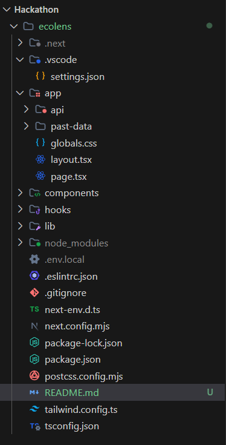
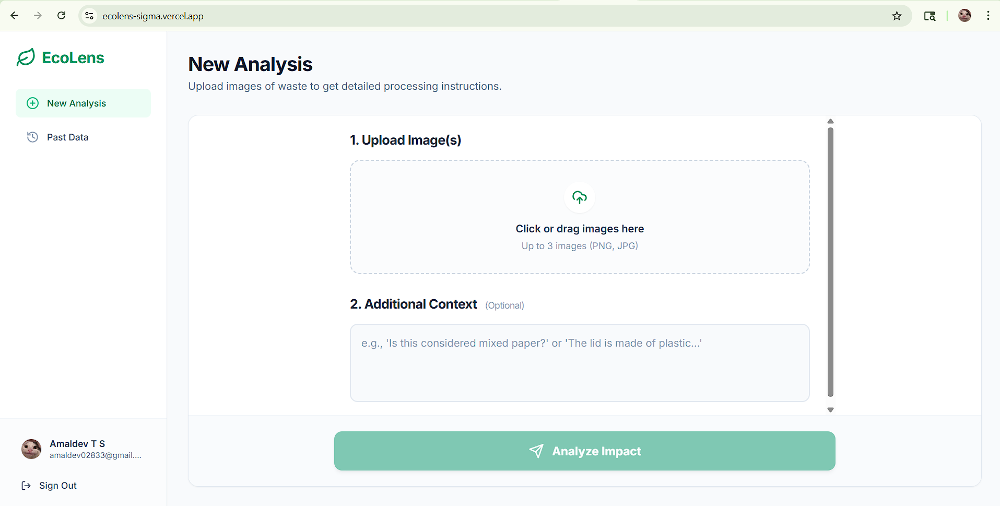
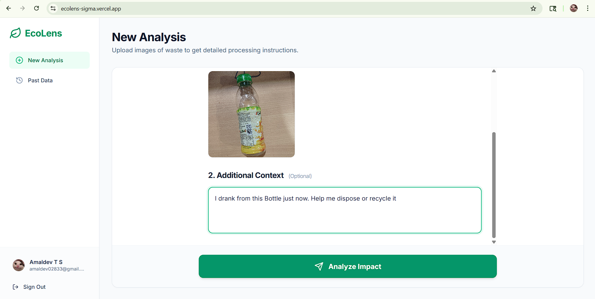
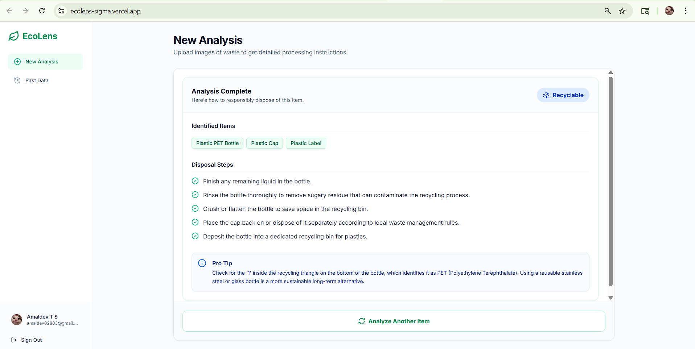

# EcoLens

## Problem Statement
Improper waste disposal and a lack of clear knowledge about recycling lead to environmental pollution and inefficiency in waste management systems. People often struggle to correctly categorize their household waste or determine whether specific items are recyclable, which commonly results in contaminated recycling streams.

## Project Description
EcoLens is an AI-powered web application designed to help users correctly classify waste and provides actionable, clear recycling guides. Users can easily upload images of their waste items, and the application uses advanced AI to analyze the image, pinpoint the waste type (e.g., recyclable, compostable, hazardous), and provide specific, step-by-step disposal instructions. It features a clean, fast, eco-friendly dashboard with local-first data persistence to track past analyses.

---

## Google AI Usage
### Tools / Models Used
- Google Gemini SDK (Gemini Vision capabilities)

### How Google AI Was Used
Google's Gemini AI is the core intelligence behind EcoLens' waste classification pipeline. When a user uploads an image of an item they wish to dispose of, the image is passed directly to the Gemini API alongside a structured analytical prompt. Gemini analyzes the visual content to identify the item, determine its material composition, and generate accurate recycling or safe disposal instructions which are then presented to the user.

---

## Proof of Google AI Usage
Attach screenshots in a `/proof` folder:



---

## Screenshots 
Add project screenshots:

  
  


---

## Installation Steps

```bash
# Clone the repository
git clone <your-repo-link>

# Go to project folder
cd ecolens

# Install dependencies
npm install

# Setup environment variables
# Copy .env.example to .env.local and add your API keys (e.g., Google Gemini API key)

# Run the project
npm run dev
```
